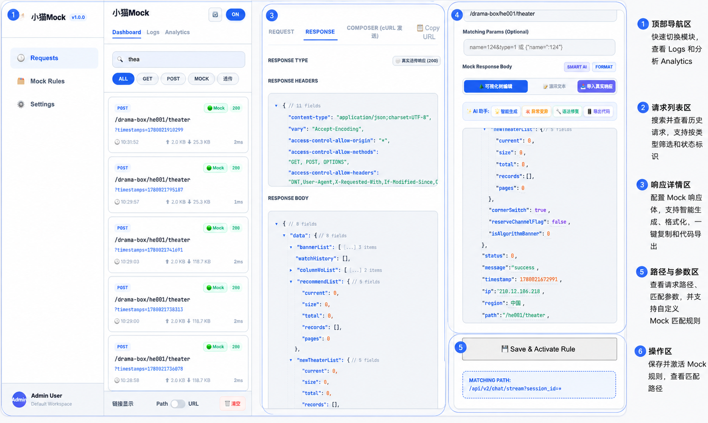
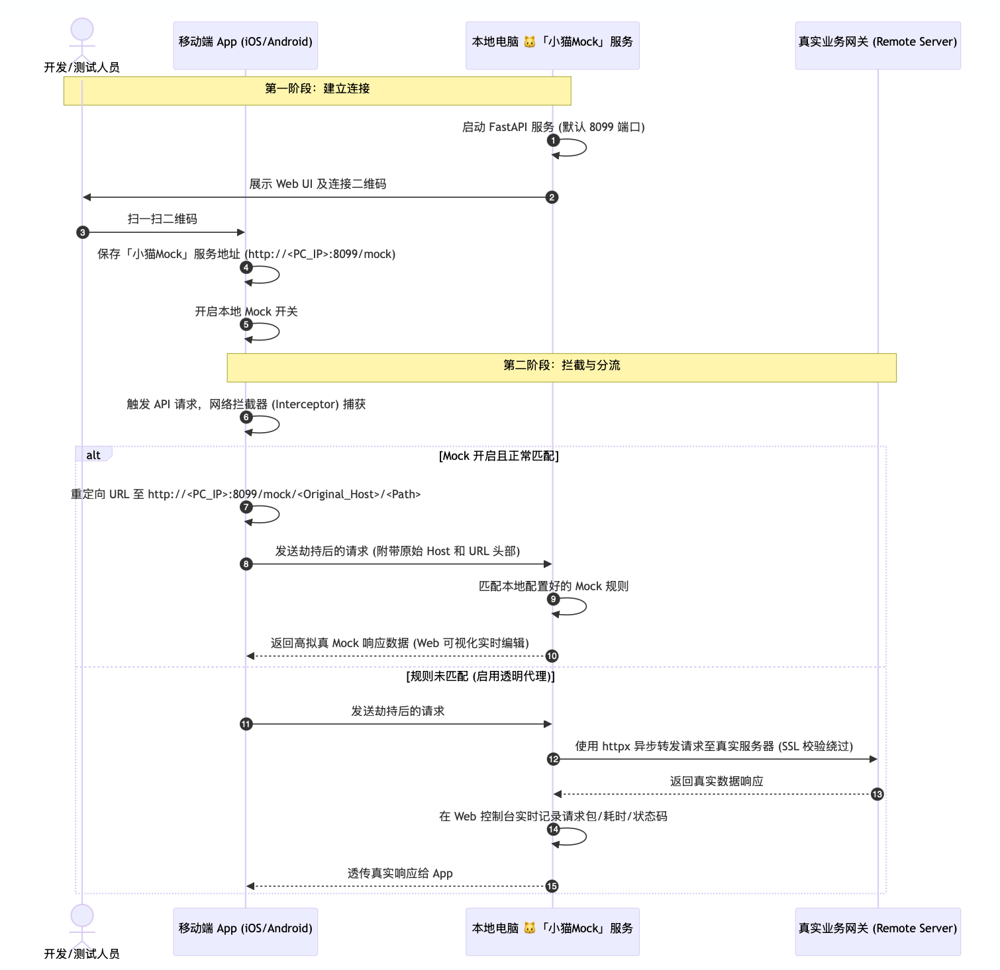
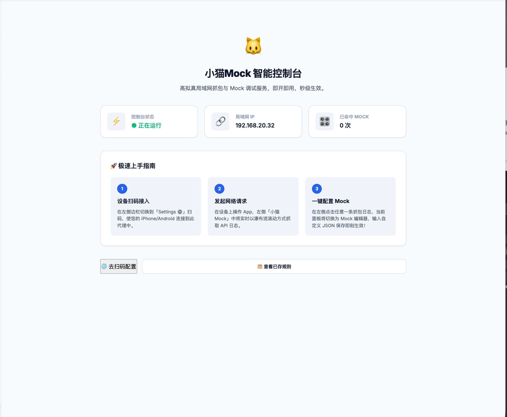
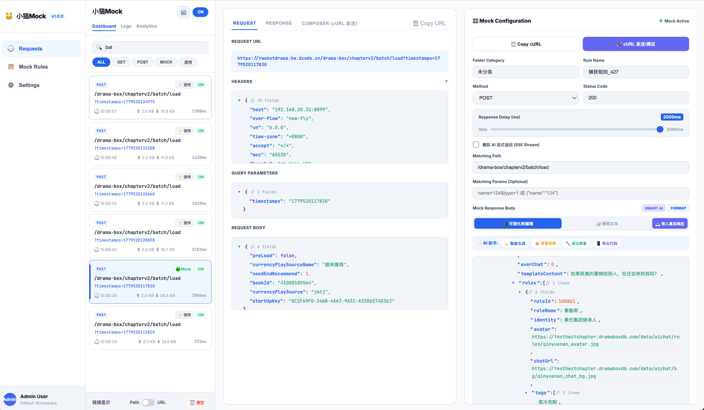
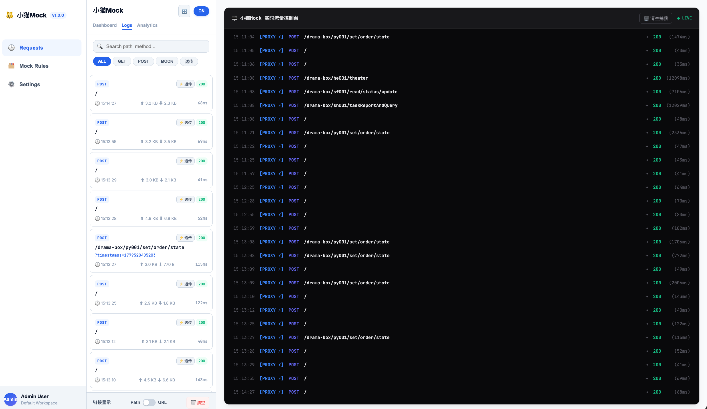
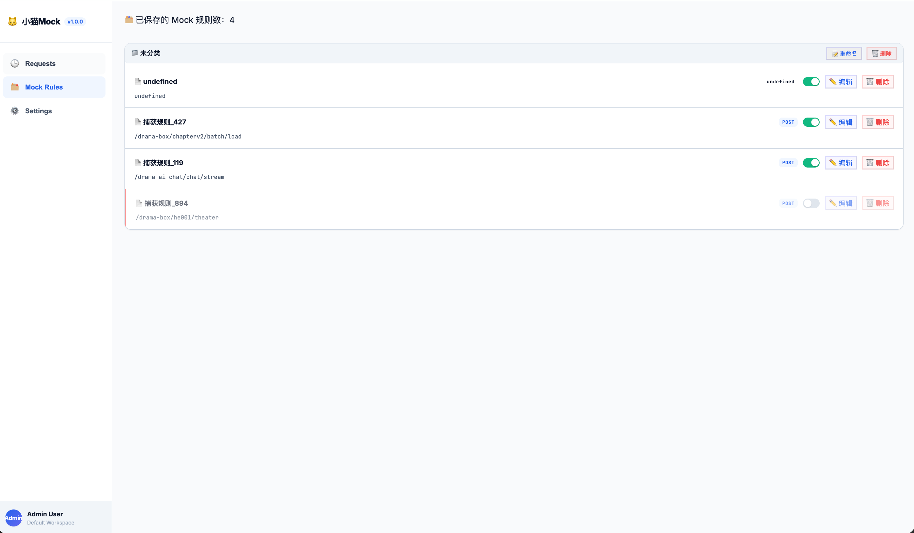
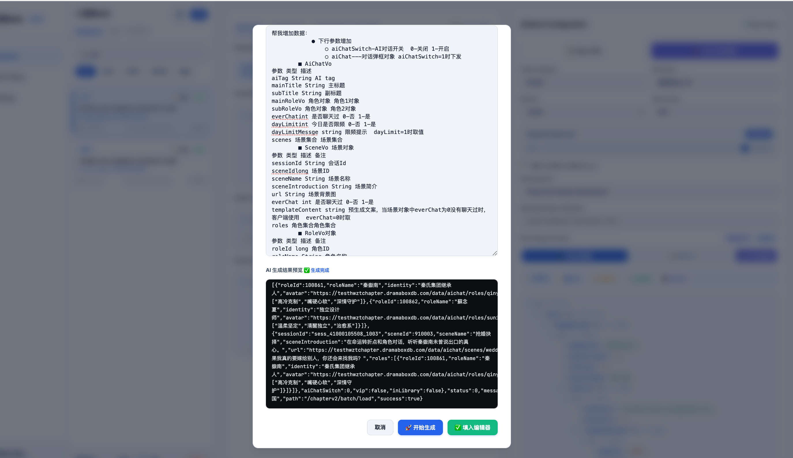
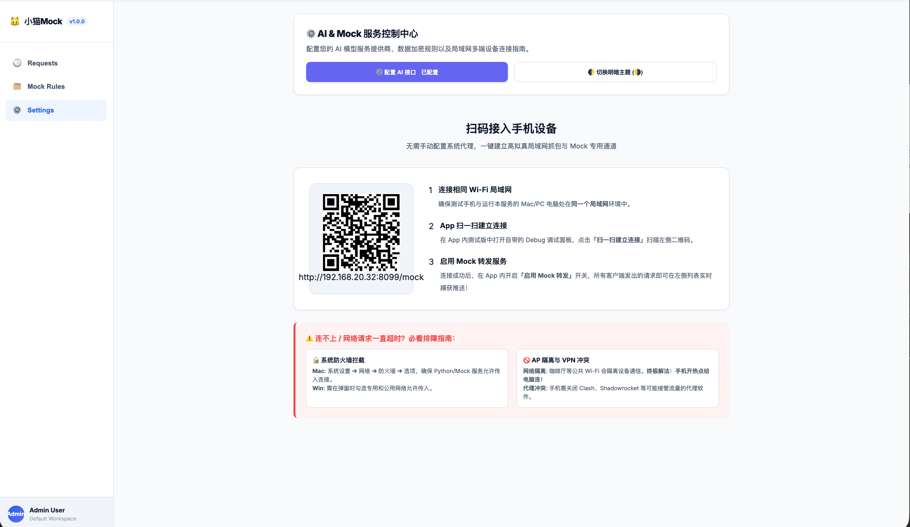

# 🐱 Little Cat Mock — AI-Driven · Standalone Private · Ultra-fast Mobile Debugging Server

[English](README.md) | [简体中文](README_zh.md)

> A 100% data-localized mobile ultra-fast wireless packet capture & mock tool. Tailor-made for iOS/Android R&D, AI-driven, proxy-free via QR code scan, ensuring mobile debugging is secure, highly efficient, and pristine.



---

## 1. 📅 Background

During the development and testing phases of mobile applications, we often encounter the following pain points:
1. **The nightmare of proxy environments**: Traditional packet capture tools (like Charles, Fiddler, Proxyman) require configuring Wi-Fi proxies on mobile devices and installing/trusting root certificates. This process is extremely cumbersome, often fails, and pollutes the device's network environment.
2. **Cumbersome Mock data generation**: Generating Mock data manually requires copying and pasting large amounts of JSON, lacking dynamic realism. 
3. **Hard-to-reproduce edge cases**: Simulating extreme network anomalies (such as missing fields, type overflow, data corruption) requires writing complex scripts, resulting in low efficiency for chaos testing.

## 2. 🎯 Objectives

Based on the pain points above, we aim to build an **ultra-minimalist and highly efficient** R&D collaboration tool:
* **Zero config & Proxy-free**: Scan the QR code with your phone to connect instantly, achieving **"0 system proxies, 0 certificate configurations"**, completely freeing developers from the nightmare of Wi-Fi proxies and HTTPS certificate trusts.
* **Efficient large-screen visualization**: Intuitively manage, auto-fill, and edit Mock data in real-time on a large-screen Web UI, with sub-second synchronization to real devices.
* **Intelligent Chaos Testing**: Deeply integrated with **AI LLMs like DeepSeek, Claude**, generating highly realistic business responses and automatically injecting anomalies for fully automated chaos testing.
* **Cross-platform support**: Provides standard interception adapters for Swift, Objective-C, Kotlin, and Java. Integrate with zero modifications to your core codebase.

## 3. 🔍 Research: How does Big Tech handle App Mocking?

Currently, top-tier tech companies typically use a "client-side network interception + centralized configuration platform" architecture. Representative examples include:
* **Meituan Shark**: Injects interception rules via an internal library on the client side, synchronizing Mock data dynamically from Meituan's internal testing platform to realize proxy-free packet capture and mock testing.
* **ByteDance TTMock**: Inwardly intercepts the network layer, combined with ByteDance's internal configuration center, supporting detailed mock rules down to specific API paths and response body modifications.
* **JD Aura / Network Library**: Extends the unified network library on the client side, switching API endpoints and injecting mock configurations dynamically via remote debug panels or sweeping code settings.

### 💡 Breakthrough and Evolution: The Core Advantages of "Little Cat Mock"

"Little Cat Mock" is not a simple imitation. It retains the essence of Big Tech's **"Client-side partial hijacking + PC large-screen visualization"** architecture while introducing leapfrog innovations tailored for small to medium-sized teams. **It establishes three core differences compared to heavy, built-in enterprise platforms**:

1. **Decentralized Standalone Sandbox Deployment (100% Data Localization)**
   Enterprise platforms often require registering on a unified central backend, sharing rules across teams, which easily leads to rule conflicts and data leakage. Little Cat Mock adopts an **extremely lightweight local standalone architecture** (available out-of-the-box as a single file). Each developer's computer acts as an independent Mock universe; the sandbox data is completely isolated, strictly guaranteeing local data privacy and zero rule pollution.
2. **Zero Intrusion to Core Services & Transparent Proxy Routing**
   Traditional Mock platforms often violently modify API endpoints globally or require complex backend cooperation. Little Cat Mock introduces a **Smart Routing Mechanism**: the App only forwards requests to the local Mock server. The server acts as a transparent proxy—if no Mock rule is matched, it seamlessly passes the request upstream to the real server. You mock exactly what you need, with zero pollution to unmocked business logic.
3. **AI Intelligent Chaos Engine Generation**
   While enterprise platforms have rich rules, they still rely on massive manual QA and R&D effort to fabricate and copy dull JSON response bodies. Born in the AI era, Little Cat Mock deeply integrates LLMs like DeepSeek / Claude. It can **dynamically generate** reasonable business data based on API parameters and **automatically inject random chaos anomalies** (gibberish, null values, overflows), completing a generational leap from a "static dictionary response" to a "dynamic intelligent data engine"!

## 4. 🛠 Technical Implementation

"Little Cat Mock" **requires no system proxies** or certificate trusts on the mobile device. Its core mechanism relies on **proxy-free direct connection & smart routing**.



### Core Workflow:
1. **Address distribution via QR code**: The App scans the QR code to obtain the local LAN IP assigned to the "Little Cat Mock" server upon startup (e.g., `http://192.168.1.5:8099/mock`) and persists it.
2. **Local client hijacking**: When Mock mode is enabled, the underlying interceptor (Interceptor/NSURLProtocol) in the App redirects the URL intended for the real backend to the LAN URL pointing to the Little Cat Mock server.
3. **Real endpoint passthrough**: The interceptor carries the original URL and original Host via HTTP Headers (`X-Original-URL`, `X-Original-Host`).
4. **Little Cat Smart Routing**: Upon receiving the request:
   * If it matches a Mock rule, it returns the customized JSON data configured by the user or dynamically generated by AI.
   * If it does not match, it acts as a transparent proxy, making a request to the real upstream server using `X-Original-URL` and returning the actual response. It simultaneously logs the transaction on the Web console, serving as a packet capture tool.

###  iOS (Swift) Core Integration Example
```swift
class LittleCatMockAdapter {
    static func adapt(_ originalRequest: URLRequest) -> URLRequest {
        guard UserDefaults.standard.bool(forKey: "DRB_MOCK_ENABLED"),
              let mockAddress = UserDefaults.standard.string(forKey: "DRB_MOCK_SERVER_ADDRESS"),
              let originalURL = originalRequest.url else { return originalRequest }
        
        let host = originalURL.host ?? "default_host"
        let path = originalURL.path
        let query = originalURL.query ?? ""
        
        // Rewrite the URL prefix to directly connect to the LAN Little Cat PC server (stripping the original Host)
        let cleanAddress = mockAddress.hasSuffix("/") ? String(mockAddress.dropLast()) : mockAddress
        let safePath = path.hasPrefix("/") ? path : "/\\(path)"
        
        var newURLString = "\\(cleanAddress)\\(safePath)"
        if !query.isEmpty { newURLString += "?\\(query)" }
        
        guard let finalURL = URL(string: newURLString) else { return originalRequest }
        
        var newRequest = originalRequest
        newRequest.url = finalURL
        newRequest.setValue("iOS-Swift-Client", forHTTPHeaderField: "X-LittleCat-Client")
        newRequest.setValue(originalURL.absoluteString, forHTTPHeaderField: "X-Original-URL")
        newRequest.setValue(host, forHTTPHeaderField: "X-Original-Host")
        return newRequest
    }
}
```

### 🤖 Android (Kotlin) Core Integration Example
```kotlin
class LittleCatMockInterceptor(private val context: Context) : Interceptor {
    override fun intercept(chain: Interceptor.Chain): Response {
        var request = chain.request()
        val mockEnabled = sharedPrefs.getBoolean("DRB_MOCK_ENABLED", false)
        val mockAddress = sharedPrefs.getString("DRB_MOCK_SERVER_ADDRESS", null)
        
        if (mockEnabled && !mockAddress.isNullOrEmpty()) {
            val originalUrl = request.url
            val host = originalUrl.host
            val path = originalUrl.encodedPath
            val query = originalUrl.query
            
            val cleanAddress = mockAddress.trim().removeSuffix("/")
            val safePath = if (path.startsWith("/")) path else "/$path"
            var newUrlString = "$cleanAddress$safePath"
            if (!query.isNullOrEmpty()) { newUrlString += "?$query" }
            
            newUrlString.toHttpUrlOrNull()?.let { newUrl ->
                request = request.newBuilder()
                    .url(newUrl)
                    .addHeader("X-LittleCat-Client", "Android-Kotlin-Client")
                    .addHeader("X-Original-URL", originalUrl.toString())
                    .addHeader("X-Original-Host", host ?: "")
                    .build()
            }
        }
        return chain.proceed(request)
    }
}
```

## 5. 📖 Tutorial

### Step 01: Establish Proxy-Free Direct Connection via QR Scan
Upon launch, the console automatically detects the LAN IP. Simply scan the QR code with your phone to establish an instant direct connection—0 configuration, no HTTP proxy, and no certificate trust required.


### Step 02: Geek-Chic Visual Dashboard
The Web console homepage allows intuitive control over the master Mock switch, intercepted request statistics, AI LLM status, and details of the connected mobile device.


### Step 03: Real Device Packet Capture & One-Click cURL
Real-time filtering and monitoring of all network requests sent by the phone, supporting sequence diagrams, latency tracking, and status tracing. Right-click to extract standard cURL commands—a perfect substitute for the Charles proxy experience.


### Step 04: Visual Rule Library & JSON Tree Editor
Supports category grouping and card-based archiving for Mock rules. Features a JSON tree editor to prevent syntax errors and supports one-click, high-fidelity autofill tuning of historical Mock payloads.


### Step 05: AI-Driven Dynamic Mock
Enable AI dynamic responses; the system adaptively matches the API path, using DeepSeek / Claude to stream contextually appropriate business data. It can also inject missing/overflow values to perform crash chaos tests.


### Step 06: Rapid Multi-Platform SDK Integration
The console includes built-in standard integration guides. Local URL redirection on the client only occurs when Mocking is enabled and a scanned connection exists, leaving the production environment unaffected and originally intended business logic completely unpolluted.


## 6. 🚀 Run & Startup Guide

### Method A: Run the Pre-packaged Standalone App (Recommended 👍)
* **🖥️ macOS**: Run `dist/小猫Mock` directly or double-click `start.command` in the project root.
* **💻 Windows**: Run `dist/小猫Mock.exe` directly or double-click `start.bat` in the project root.

After starting, the system will automatically open your default browser to the Web main panel: `http://127.0.0.1:8099`.

### Method B: Start from Source & Virtual Environment (Developer Mode)
1. **Install dependencies**:
   ```bash
   python3 -m venv .venv
   source .venv/bin/activate
   pip install fastapi uvicorn pydantic httpx lz4
   ```
2. **Start the service**:
   * macOS: `bash build.sh`
   * Windows: `package.bat`

## 7. 📦 Build & Package
If you modify the underlying engine logic or frontend interface, you can use the built-in scripts to repackage a clean executable:
* **macOS**: Run `sh package_mac.sh` to output `dist/小猫Mock.app`
* **Windows**: Run `package_win.bat` to output `dist/小猫Mock.exe`

## 8. 🛠️ FAQ & Troubleshooting

If your App fails to connect to the "Little Cat Mock" server (requests stuck loading or timing out) after establishing a direct LAN connection, please verify the following:

1. **Firewall Blocks**:
   * **macOS**: Check "System Preferences" -> "Firewall", ensuring incoming connections are allowed for `Python` or `小猫Mock`.
   * **Windows**: When the security alert pops up on the first launch, ensure both "Private networks" and "Public networks" are checked to allow access.
2. **AP Isolation / Guest Network Restrictions**:
   Some corporate or cafe Wi-Fi networks have AP isolation enabled, preventing devices on the LAN from communicating with each other. **Solution**: Turn on your phone's personal hotspot and connect your computer to it, creating a clean, isolated mini-LAN.
3. **VPN / Proxy Software Conflicts**:
   Ensure that no global proxies like Clash or Surge are running on either the phone or computer. These applications hijack routing rules, preventing `192.168.x.x:8099` from connecting correctly.

---
💡 **Happy debugging! If you have any suggestions, feel free to share your feedback!** 🐱
