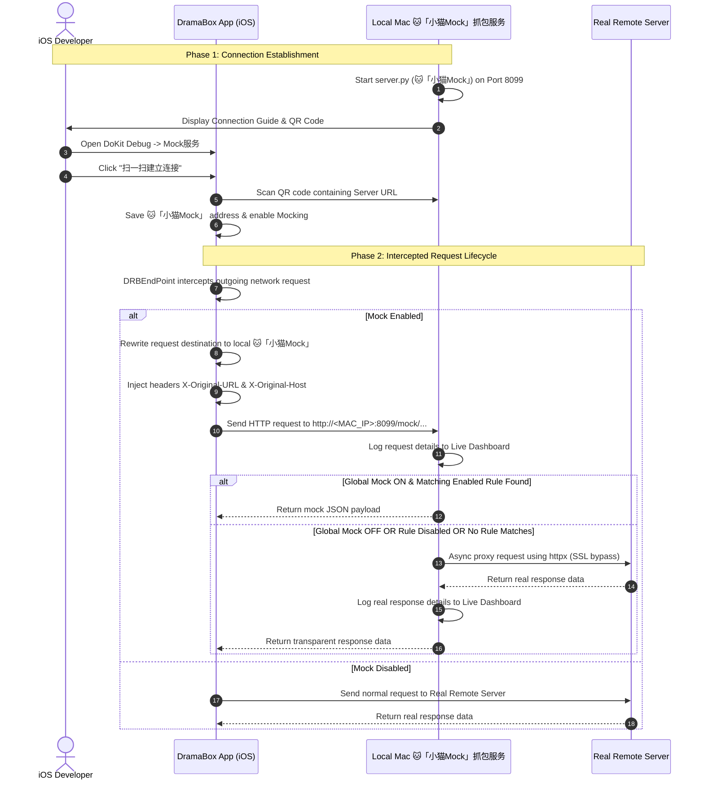

# iOS App & Mac 🐱「小猫Mock」抓包与 Mock 服务系统

This system enables real-time HTTP traffic capture, global controls, rule-based mocking, and seamless transparent proxying for the `DramaBox` app using a local Mac 🐱「小猫Mock」抓包服务.

---

## 1. System Architecture



---

## 2. Completed Implementations

### A. Client-Side (iOS App)

1. **Native QR Code Scanner & Debug Panel (`DRBDebugMockPlugin.swift`):**
   * Registered a custom `@objc` class conforming to DoKit's `DoraemonPluginProtocol`.
   * Created a settings controller `DRBDebugMockViewController` with:
     * A Doraemon-styled `DoraemonCellSwitch` to toggle global client-side Mocking.
     * A cell button to trigger the scanner.
     * A label displaying the current server address.
   * Built a full-screen high-performance `DRBQRScannerViewController` powered by native `AVFoundation` (`AVCaptureSession` and `AVCaptureMetadataOutputObjectsDelegate`) with auto-vibration feedback, a custom navigation bar, and automatic IP parsing logic.
2. **Plugin Registration (`DRBDebugManager.swift`):**
   * Registered the new `Mock服务` plugin under both `#if DEBUG || HOT` and `#elseif !TAG` conditions, ensuring availability across debug builds and internal testing releases.
3. **URL Interception & Redirection (`DRBEndPoint.swift`):**
   * Modified the convenience initializer of `DRBEndPoint` (Moya's sub-component) to check `DRB_MOCK_ENABLED` and `DRB_MOCK_SERVER_ADDRESS` from `UserDefaults`.
   * Automatically rewrites target URLs to destination `http://<MAC_IP>:8099/mock/<path>` and injects headers:
     * `X-Original-URL` (e.g. `https://api.dianzhong.com/video/index/1234/home`)
     * `X-Original-Host` (e.g. `https://api.dianzhong.com`)

### B. Server-Side (Mac MockServer)

1. **Routing and Async Proxy fallback (`server.py`):**
   * Added `mock_global_enabled = True` in-memory flag.
   * Added `/api/config` (`GET` & `POST`) endpoints to read/write global settings.
   * Expanded `MockRule` Pydantic schema to support the optional `enabled: bool = True` field.
   * In `handle_mock_request`, if Mock is Globally ON and a rule is matched & enabled, it serves the Mock JSON.
   * If not mocked, it extracts the custom `X-Original-URL` header and performs an async, non-blocking transparent proxy using `httpx.AsyncClient(verify=False)`, stripping conflicting headers and safely logging real responses onto the dashboard without interrupting the app flow.
2. **Premium Dashboard Control UI & Dual-Theme System (`templates/index.html`):**
   * Designed a responsive global toggle switch in the dashboard's header next to the tab navigation that reflects and updates the server's global mock configuration live.
   * Added the "是否启用此规则" toggle switch inside the rules configuration editor.
   * Added highly interactive **inline toggle switches** directly on each card in the rules library list view. Users can enable/disable rules with a single click. Rules that are disabled dynamically decrease opacity and show a red left-border indicator.
   * **Dual-Theme Design System (Light & Dark):** Integrated a beautiful HSL-curated stylesheet supporting a bright **Light Mode (Default)** and a premium **Dark Mode**. Designed a theme toggle button `🌙` / `☀️` on the left header pane that saves the theme state to `localStorage` and synchronizes styles instantly before rendering to prevent visual flashing.
   * **Real-time Log Search & Filtering:** Implemented a highly responsive filtering and search bar directly inside the left panel. Supports real-time text-based search (matching URL paths, HTTP methods, headers, query parameters, and request body content) coupled with high-contrast tab filters for `GET`, `POST`, `🟢 Mock`, and `⚡ 透传` status flags, using an optimized local in-memory log cache.
3. **LZ4 Automatic Decompression Engine (`server.py`):**
   * Decodes Hive Batch tracking logs (`x-encrypt-type: 1000` / `Content-Type: application/octet-stream`) on-the-fly.
   * Automatically decompresses Moya-sent binary tracking requests using the fast native `lz4.block` decoder and the `content-raw-size` header size limit.
   * Displays the fully decompressed JSON data structurally inside the Collapsible JSON tree viewer, completely resolving payload garbling.

---

## 3. Cross-Platform Standalone Tool Compilation (macOS & Windows)

To distribute the `小猫Mock` server as a standalone executable tool that runs on other computers (both Windows and macOS) without requiring Python or manual package installation, we have provided an automated packaging script [`package.py`](file:///Users/lhl/Documents/coding/drama_ios_副本2/MockServer/package.py).

### How to Compile:

1. **On macOS (to generate macOS binary):**
   * Open your terminal, navigate to the `MockServer` folder, and run:
     ```bash
     python3 package.py
     ```
   * The standalone executable binary file `小猫Mock` will be created inside the `dist/` directory.

2. **On Windows (to generate Windows `.exe` binary):**
   * Open Command Prompt (`cmd`) or PowerShell in the `MockServer` folder, and run:
     ```cmd
     python package.py
     ```
   * The standalone executable file `小猫Mock.exe` will be created inside the `dist/` directory.

### Persistent Rule Storage Architecture:
When compiled with PyInstaller, all HTML static assets and templates are automatically compressed and embedded inside the binary. They are extracted to a temporary memory directory `_MEIPASS` when executed.
To prevent user rules from being lost when the application is closed, we implemented a **persistent runtime storage check**:
* It automatically identifies if it is running inside a PyInstaller frozen environment.
* If frozen, it sets `DATA_DIR` to the *actual physical folder* where the executable is launched (`mock_data/` next to the executable), rather than inside `_MEIPASS`. This ensures all mock rules remain safely persistent on the user's disk across restarts.

