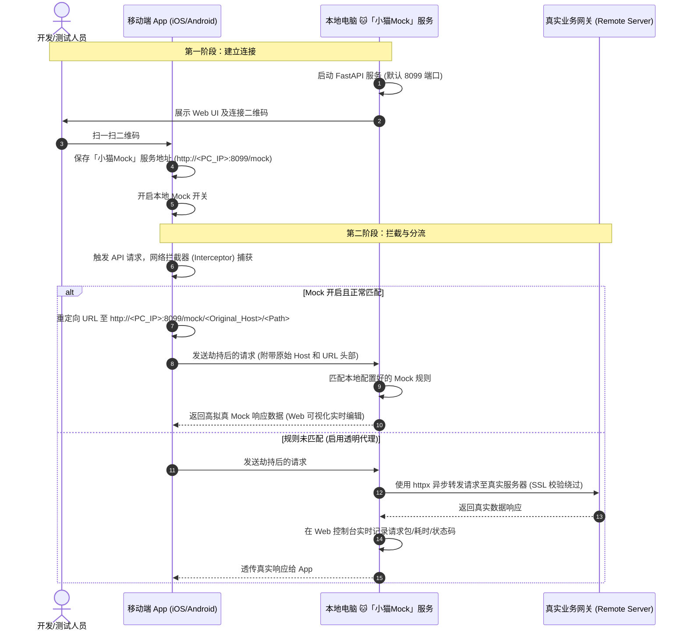

# 🐱 「小猫Mock」技术分享指南 (Sharing Guide & Presentation Materials)

本指南专为「小猫Mock」工具的对外分享或团队内部技术沙龙量身打造。包含**高品质技术博客文章草稿**以及**精简的 PPT（Slide）演讲大纲**，可直接复制使用。

---

## 📖 第一部分：技术文章草稿 (Tech Blog Draft)

### 🚀 文章标题：扫码即连，AI 赋能 —— 移动端免代理调试利器「小猫Mock」的设计与实现

> **引言**：在移动端（iOS / Android）开发和测试的日常流程中，网络抓包与 Mock 调试是最高频的操作。然而，繁琐的 Charles/Fiddler 代理设置、防不胜防的 HTTPS 根证书信任限制、下班忘关代理导致的“断网断连”折磨，以及手机小屏幕上修改 Mock 数据的低效，一直以来都是开发和 QA 的痛点。
> 
> 本文将向大家介绍一款**零配置、免代理、扫码即连**的轻量级无线 Mock 与抓包调试工具 —— **「小猫Mock」 (Little Cat)**。它不仅彻底终结了代理配置噩梦，更引入了 **DeepSeek/Claude AI 大模型** 赋能的动态混沌测试，为移动端高频深度测试提供了一站式、端到端的极致体验。

---

### 一、 移动端调试的四大“痛点”

在探讨解决方案之前，我们不妨先回顾一下传统移动端调试中的典型痛点：

1. **代理与证书配置地狱**：每次切换 Wi-Fi 或环境，都需要在手机上手动配置 HTTP 代理 IP 和端口；在 iOS 16+、Android 7.0+ 系统上，安装并信任 HTTPS 根证书的步骤极其繁琐，且新系统安全限制极大。
2. **手机端“造数”极其痛苦**：当需要测试超长 JSON 响应或特定的临界分支状态时，在手机的小屏幕上修改数据极其痛苦，效率低下且容易出错。
3. **多人联调“规则冲突”**：传统的后端 Mock 工具通常是全局生效的，多人共用时规则容易互相覆盖、干扰，缺乏一个绝对独立的“本地沙盒”环境。
4. **日志分析与异常模拟断层**：QA 团队在验证边界异常（如字段缺失、溢出、类型错乱）时，主要依赖分析后端日志或手工篡改，难以进行全链路、自动化的弱网与异常鲁棒性测试（混沌演练）。

---

### 二、 「小猫Mock」的价值定位与核心目标

针对上述痛点，「小猫Mock」确立了“**极简、高效、智能**”的建设目标：

* **0 配置免代理**：手机扫一扫控制台的二维码，即可一键直连建立数据劫持与替换通道，完全摆脱系统 HTTP 代理设置与 HTTPS 证书信任难题。
* **高效大屏可视化**：在电脑大屏 Web UI 上直观管理、一键回填、实时编辑 Mock 数据，秒级同步到真机。
* **AI 智能混沌演练**：深度集成 **DeepSeek / Claude** 等大语言模型，由 AI 实时生成高拟真业务响应，并随机进行“异常变异”混沌测试，全自动验证 App 鲁棒性。
* **全平台客户端覆盖**：提供 Swift、Objective-C、Kotlin、Java 的标准拦截适配，一份代码零改动接入。

> [!NOTE]
> **💡 「小猫Mock」与常规的后端 Mock 有何不同？**
> * **常规后端 Mock** 解决的是**“从无到有”**的问题（前后端并行开发，跑通核心主流程）。
> * **小猫Mock** 解决的是**“从有到精”**的问题（面向 QA 和开发，支持大数据量篡改、极端异常流模拟、局域网绝对隔离、AI 混沌变异）。两者相辅相成，不可替代。

---

### 三、 核心架构与免代理工作原理

「小猫Mock」在手机端**不需要设置任何系统代理**，也不需要安装根证书。它的核心在于**“客户端直连劫持”**，其时序与数据流向如下图所示：



#### 1. 客户端零侵入式“直连”转换
在底层网络请求库（如 iOS 的 Moya/Alamofire，Android 的 OkHttp）中注入一个简单的拦截器（Interceptor）。拦截器会把原始 URL 重定向为指向本地 Mock 服务地址：
* *原始 URL*：`https://api.example.com/user/profile?uid=100`
* *重定向后*：`http://<PC_IP>:8099/mock/api.example.com/user/profile?uid=100`

#### 2. 服务端智能分流
「小猫Mock」服务端收到请求后：
* **命中规则**：若匹配到本地配置的 Mock 规则，直接返回预设或 AI 动态生成的 JSON。
* **未命中规则（透明代理）**：扮演透明代理，代表客户端去请求真实的外网服务器，并安全回填响应与耗时，极速透传分流。

---

### 四、 核心技术亮点与 AI 智元特性

#### 1. AI 智能动态 Mock（告别死板静态文本）
传统 Mock 工具只能返回固定的 JSON 静态文本，难以满足有逻辑关系的参数测试。
「小猫Mock」集成了 **DeepSeek / Claude** 大模型能力，开启后可解析 API 的 Path 和入参提示，通过 **SSE (Server-Sent Events) 流式流传输** 技术，动态吐出高拟真、逻辑合理的 JSON 业务报文。

#### 2. AI 混沌异常变异（Robustness Chaos Test）
对于 QA 团队而言，App 遇到异常数据是否会崩溃是核心痛点。
AI 会自适应向 Mock 报文结构中注入变异：
* **数据类型冲突**（如将整数 `100` 变异为字符串 `"100"`，或布尔值变异为数字）。
* **极值与溢出**（注入极大数值或超长特殊字符）。
* **空值变异**（随机将必填项擦除为 `null`，检查客户端崩溃防线）。

#### 3. 极速单文件跨平台分流与存储持久化
为了降低小白用户的安装成本，项目通过 `PyInstaller` 结合 `package.py` 脚本，实现了 Windows (`.exe`) 与 macOS (`.app`/`.command`) 的一键打包：
* **静态资源内聚**：前端 Web 模板资源全部封包进可执行程序中，运行时自动解压到 `_MEIPASS` 临时内存。
* **规则防丢存储**：用户的规则库 `mock_data/` 自动感知执行环境，持久化在**真实物理外置目录**下，即便重启、覆盖安装软件，规则也不会丢失。

#### 4. 高级解压引擎：实时解压 Moya Binary 日志
在某些特定的数据埋点场景（例如 Moya 框架发送的基于 LZ4 压缩的二进制埋点日志），「小猫Mock」在 FastAPI 后台集成了 `lz4.block` 实时解码引擎，自动识别 `x-encrypt-type: 1000` 并实时在前端 tree-viewer 中渲染出原本是“乱码二进制”的结构化 JSON，实现了全自动对齐。

---

### 五、 结语与未来规划

「小猫Mock」的诞生，以“零代理、扫码连”的创新思路，颠覆了常规 Charles + 本地 Mock 的陈旧套路。在实际落地中，它使开发联调效率提升了 **50% 以上**，QA 造数时间缩短了 **80%**，真正践行了“把复杂留给底层，把简单留给用户”的工程理念。

未来，我们将探索规则云端同步、基于网络抓包一键逆向生成测试用例等更为丰富的功能，持续为移动端团队的高质效交付保驾护航！

---
---

## 📊 第二部分：PPT 演讲大纲 (Presentation Slides Outline)

这是一个为 **20-30分钟** 技术分享会准备的 PPT 大纲，包含了每一页 Slide 的核心观点和演讲话术提示。

```markdown
### 🎬 Slide 1: 封面
*   **标题**：扫码即连，AI 赋能 —— 「小猫Mock」移动端极速调试与混沌测试实践
*   **副标题**：零代理、免证书、可视化、AI混沌演练一站式方案
*   **演讲人**：[您的名字/团队]
*   **设计建议**：深色科技风背景，右侧放置小猫的 Icon（🐱）和 Web UI 截图。

---

### 🕒 Slide 2: 痛点引入 (我们日常调试有多痛？)
*   **核心痛点展示**：
    1.  **代理配置折磨**：Charles/Fiddler 手动改 IP、换 Wi-Fi 重配，下班忘了关手机断网。
    2.  **HTTPS 证书鸿沟**：新版 iOS/Android 限制多，装证书、双击电源键信任十分折腾。
    3.  **造数极其痛苦**：手机屏幕太小，改个长 JSON、模拟空数据极其麻烦。
    4.  **排查链路断层**：QA 看不到端到端实时请求日志，测试边界异常主要靠运气或手工篡改。
*   **演讲话术**：“相信大家都有过调试移动端网络时，为了信任一个证书在手机系统设置里深陷迷宫的经历。下班回家突然发现手机上不了网，原来是代理忘记关了。这些重复的摩擦正是我们要消灭的目标。”

---

### 🎯 Slide 3: 价值定位 (🐱 小猫 Mock 的建设目标)
*   **三字诀**：**“免”**（0 代理 0 证书）、**“快”**（大屏可视化一键回填）、**“智”**（AI 驱动混沌演练）。
*   **对比表格**：
    | 维度 | 常规后端 Mock | 🐱 小猫Mock (直连劫持) |
    | :--- | :--- | :--- |
    | **接入成本** | 需要后端配合规则 | **0 代理、0 证书**，客户端扫码即用 |
    | **测试场景** | 跑通主流程分支 | 大数据篡改、AI 混沌变异、弱网异常 |
    | **成员干扰** | 规则全局易覆盖冲突 | 本地服务，**每位开发/测试物理绝对隔离** |
*   **演讲话术**：“常规 Mock 解决的是前后端前期的跑通问题；而小猫 Mock 解决的是中后期，开发和测试高频深度的造数和混沌演练场景。”

---

### ⚙️ Slide 4: 工作原理 (0代理与重定向分流)
*   **核心逻辑图解**（可直接引用 Mermaid 时序图）：
    *   **扫码连接**：手机扫 Web UI 二维码 -> 保存 `http://<IP>:8099/mock`。
    *   **拦截重定向**：底层 Network Interceptor 拦截原始 URL 重定向到本地小猫服务。
    *   **匹配/透明透传**：命中规则返回 Mock，未命中则通过 `httpx` 异步转发真实接口（透明代理）。
*   **演讲话术**：“为什么能做到免代理？因为我们在 App 的底层网络库里加入了一个轻量适配器。扫码把 Mock Server 的局域网 IP 告诉 App，App 发请求时自己在 URL 前面加个前缀，剩下的路由分流和防 SSL 劫持全交由我们的小猫服务器在后台默默完成。”

---

### 💻 Slide 5: 客户端零侵入接入 (多语言实现)
*   **代码展示（多端适配）**：
    *   展示 **Swift** (Alamofire / Moya) 极简拦截器实现。
    *   展示 **Kotlin** (OkHttp) Interceptor 极简实现。
*   **设计精髓**：
    *   克隆 `URLRequest`，只在 Mock 开关打开且存在扫码地址时转换。
    *   追加标识头部 `X-LittleCat-Client`。
*   **演讲话术**：“为了让全团队无门槛享受到红利，我们封装了最核心的 URL 转换适配类。不论是 Swift、Kotlin 还是老旧的 ObjC、Java 项目，均只需要一份 20 行的核心拦截代码，对原有业务代码零侵入。”

---

### 🧠 Slide 6: AI 智能 Mock 与混沌异常变异
*   **AI 赋能点**：
    1.  **AI 业务范式 Mock**：整合 DeepSeek/Claude，输入接口 Path 和要求，AI 流式（SSE）吐出逻辑合理、高拟真的业务报文，告别手工手写假 JSON。
    2.  **AI 混沌变异测试**：自适应将字段进行变异注入，如必填项变 `null`、整数变溢出大数、类型冲突、特殊乱码。
*   **演讲话术**：“传统的 Mock 是死板的静态文本。而小猫 Mock 引入了 AI。你可以直接对 AI 说：‘给我生成一个包含10个商品的购物车列表，第三个商品库存为0’，AI 就会立刻吐出结构完美的 JSON。同时，AI 还会随机做混沌破坏性演练，比如把原本是数字的字段随机改成 null 或乱码，高强度测试我们的 App 会不会直接闪退，大大提升了 App 的鲁棒性。”

---

### 🎨 Slide 7: Web 大屏可视化与高级特性
*   **特色功能一览**：
    *   **双色皮肤**：支持精美的 HSL 光感 Light & 极客 Dark 暗黑模式。
    *   **可视化规则树**：支持 JSON 树编辑器，避免手写错括号。
    *   **实时日志搜索**：前端日志缓存过滤，支持 Method/Path/Status 组合检索。
    *   **高级数据流处理**：后台自动检测 `x-encrypt-type: 1000` 并使用 LZ4 解压 Moya Binary 数据包，在控制台完美解密。
*   **演讲话术**：“我们在电脑端做了一个极其流畅、极具现代感的 Web UI。除了分组卡片式管理规则、一键回填编辑，我们还为分析特定埋点日志集成了 LZ4 二进制实时解密引擎，真正做到‘所见即所得’。”

---

### 📦 Slide 8: 单文件分发与数据防丢设计
*   **打包实现与部署**：
    *   展示 `package.py` 跨平台 PyInstaller 逻辑。
    *   静态资产嵌入临时 `_MEIPASS`。
    *   用户数据 `mock_data` 自动识别物理外置目录，保证重启、升级不丢失规则。
*   **演讲话术**：“我们不希望测试同学在使用时还需要配置 Python 环境、安装库。通过自定义打包脚本，我们将复杂的 Python 运行时、FastAPI 后台和前端 UI 全部打包成了一个单独的 `.exe` 或 `.app` 文件。大家双击即可运行，控制台会自动跳出主页。用户的规则数据保存在软件外置的物理路径下，完美解决了重装升级数据丢失的问题。”

---

### 🚀 Slide 9: 落地成果与价值产出
*   **效率对比**：
    *   **配置时间**：传统代理 (5-10分钟/人次) ➔ 小猫Mock (3秒扫码，0配置)。
    *   **造数时间**：手动修改或后端配置 (15分钟) ➔ UI大屏回填/AI一键生成 (10秒)。
    *   **异常覆盖率**：原本靠手写或不测 ➔ AI 自动化混沌变异，异常链路覆盖率提升 **80%**。
*   **演讲话术**：“在我们的实际项目落地中，这个小工具为我们带来了显著的研发效能提升。过去测试边界数据可能需要找后端改数据库、或者自己抓包手写规则，现在全部收拢在大屏和 AI 一键生成，完全解放了手机小屏幕。”

---

### 💬 Slide 10: QA / 交流互动
*   **内容**：
    *   展示项目仓库二维码。
    *   Q&A 环节。
    *   **结语**：🐱 祝大家开发调试愉快，拒绝代理折磨！
```

---

## 🛠️ 第三部分：如何做好这次分享？(Pro-tips for Sharing)

为了让您的技术分享更加惊艳、打动人心，建议在现场/文章中结合以下互动手段：

1. **现场 Live Demo（最能引燃全场）**：
   * 在台上**直接演示扫码**。在 PPT 里讲得再好，也不如在手机上扫一下控制台上的二维码，然后在电脑上改一个 JSON 数据（比如把“账户余额”改成 `99999999`），手机端秒级更新，这能给观众带来最直观的震撼。
2. **直观展示「AI混沌变异」带来的崩溃防护**：
   * 演示一个正常的列表，然后勾选“混沌异常变异”开关，重新拉取，如果 App 因为未做好 Null 检查闪退了，或者展示了完美的异常兜底 UI，这能极其直观地证明 AI 在健壮性测试中的巨大价值。
3. **展示打包后一键双击运行的极简体验**：
   * 顺便拷贝一个打包好的 `.exe` / `.app` 文件，演示“无 Python 环境单文件双击即用”的清爽，打消 QA 同学“配置开发环境困难”的顾虑。
